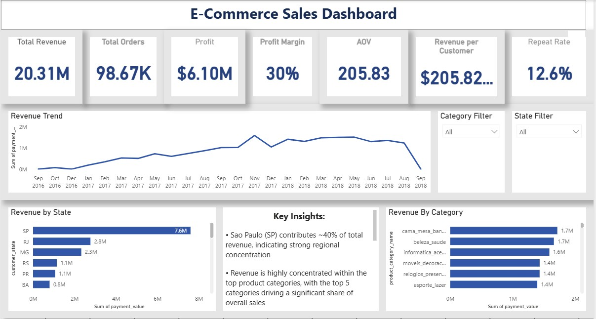

# 📊 E-Commerce Data Platform

## 🚀 Project Overview

This project demonstrates a **production-style end-to-end data pipeline** that transforms raw e-commerce data into actionable business insights.

It simulates a real-world data engineering workflow, covering:

* Data ingestion from raw CSV files
* Data transformation using Python & SQL
* Data warehousing using PostgreSQL (Star Schema)
* Workflow orchestration using Apache Airflow (Dockerized)
* Business intelligence visualization using Power BI

---

## 🧱 Architecture

Raw Data (CSV)
⬇
Python ETL Pipeline
⬇
PostgreSQL Database
⬇
Airflow Orchestration (Docker)
⬇
SQL Data Warehouse (Fact & Dimension Tables)
⬇
Power BI Dashboard

---

## ⚙️ Tech Stack

* **Python** (Pandas, SQLAlchemy)
* **PostgreSQL**
* **Apache Airflow** (Dockerized)
* **Power BI**
* **SQL**
* **Docker**
* **Git & GitHub**

---

## 📂 Project Structure

```
ecommerce-data-platform/
│
├── dags/                # Airflow DAGs (workflow orchestration)
├── scripts/             # ETL pipeline scripts
├── sql/                 # Data warehouse SQL scripts
├── dashboard/           # Power BI dashboard
├── data/                # Raw data (excluded from GitHub)
├── docker-compose.yml   # Airflow container setup
├── requirements.txt
└── README.md
```

---

## 🔄 ETL Pipeline

The ETL pipeline:

* Reads raw CSV files
* Cleans and transforms data
* Loads data into PostgreSQL tables
* Supports **incremental data loading**

Run locally:

```
python scripts/etl_pipeline.py
```

---

## ⚙️ Workflow Orchestration (Airflow)

This project uses **Apache Airflow** to automate and monitor the ETL pipeline.

### Features:

* Scheduled pipeline execution (`@daily`)
* Task monitoring and logging
* Dockerized environment for reproducibility
* DAG-based workflow management

### Run Airflow:

```
docker-compose up
```

### Access UI:

```
http://localhost:8080
```

### Login:

* Username: `admin`
* Password: `admin`

---

## 🧠 Data Modeling

Implemented a **Star Schema** for efficient analytics:

### Fact Table:

* `fact_sales`

### Dimension Tables:

* `dim_customers`
* `dim_products`

---

## 📊 Dashboard

### Key Insights:

* Sao Paulo contributes ~40% of total revenue
* Revenue is concentrated in top product categories
* Average Order Value (~205) indicates mid-range purchasing
* Repeat Rate (~12%) highlights low customer retention
* Profit margin (~30%) shows healthy profitability


---

## 🖼️ Dashboard Preview



---

## 🔐 Environment Setup

Create a `.env` file:

```
DB_PASSWORD=your_password
```

---

## 📦 Installation

```
pip install -r requirements.txt
```

---

## 📌 Dataset

Dataset sourced from:
**Brazilian E-Commerce Public Dataset (Olist)** – Kaggle

---

## 🎯 Key Learnings

* End-to-end data pipeline development
* Incremental ETL pipeline design
* Data warehouse modeling (Star Schema)
* Workflow orchestration using Airflow
* Containerization using Docker
* Business intelligence and dashboarding

---

## 👤 Author
**Samrud Shetty**

